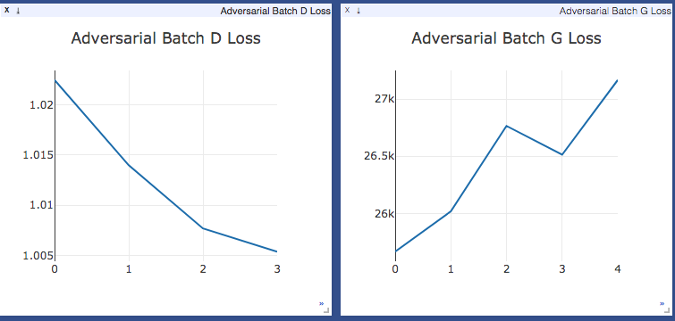

# SeqGAN-PyTorch
A implementation of SeqGAN in PyTorch, following the implementation in tensorflow.


## Requirements: 
* **PyTorch v0.1.12**
* Python 3.6
* CUDA 9.1 (For GPU)

## Origin
The idea is from paper [SeqGAN: Sequence Generative Adversarial Nets with Policy Gradient](https://arxiv.org/pdf/1609.05473.pdf)

The code is rewrited in PyTorch with the structure largely from [Tensorflow Implementation](https://github.com/LantaoYu/SeqGAN)

## Running
```
$ python main.py
```
After runing this file, the results will be printed on terminal. You can change the parameters in the ```main.py```.


__Using CUDA__

Pass in the gpu device number for e.g. `0`
```
$ python main.py --cude {GPU_DEVICE_NUMBER}
```

__Enable Visualization__

Run with `--visualize` parameter
```
$ python main.py --cude {GPU_DEVICE_NUMBER} --visualize
```


