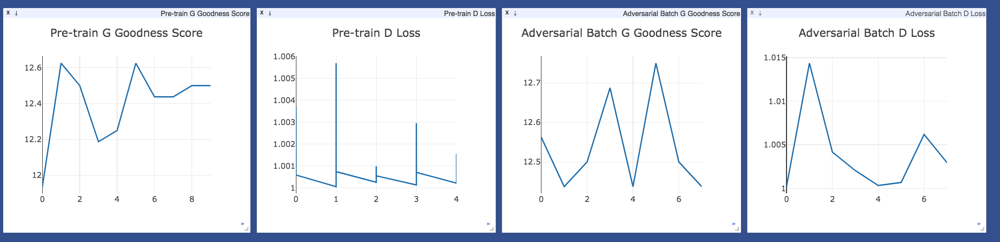
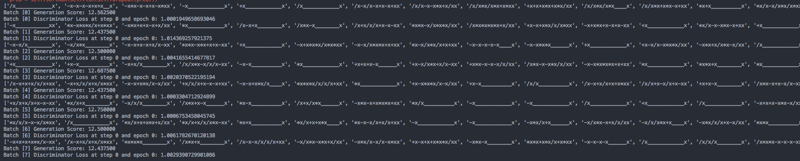

# Sequence Generation with GANs trained by Gradient Estimation

## Requirements: 
* **PyTorch v0.4**
* Python 3.6
* CUDA 9.1 (For GPU)

## Origin
The idea is from paper [SeqGAN: Sequence Generative Adversarial Nets with Policy Gradient](https://arxiv.org/pdf/1609.05473.pdf).
We build on SeqGAN and compare three gradient estimators for sequence generation with GANs: REINFORCE (as in SeqGAN), and state-of-the-art REBAR (https://arxiv.org/pdf/1703.07370.pdf) and RELAX (https://arxiv.org/pdf/1711.00123.pdf). 

The code is rewrited in PyTorch with the structure derived from (https://github.com/LantaoYu/SeqGAN)

## Running
```
$ python main.py
```
After runing this file, the results will be printed on terminal. You can change the parameters in the ```main.py```.


__Using CUDA__

Pass in the gpu device number for e.g. `0`
```
$ python main.py --cude {GPU_DEVICE_NUMBER}
```

__Enable Visualization__

Start the server (probably in a screen or tmux):
```bash
python -m visdom.server -port 8097
```

Run with `--visualize` parameter
```
$ python main.py --cude {GPU_DEVICE_NUMBER} --visualize
```






